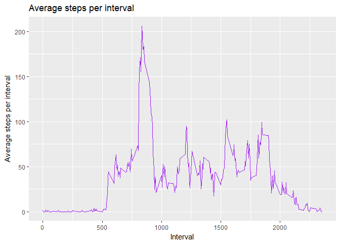
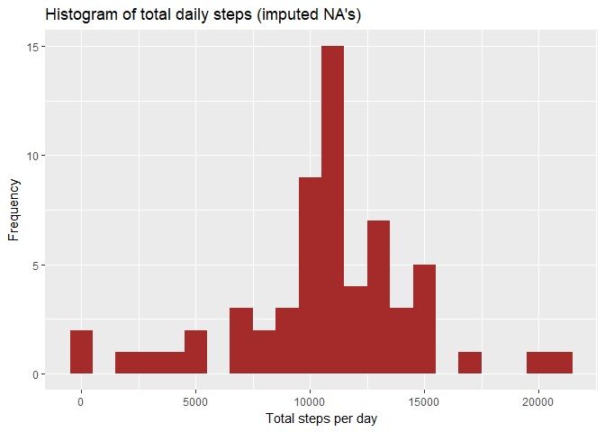
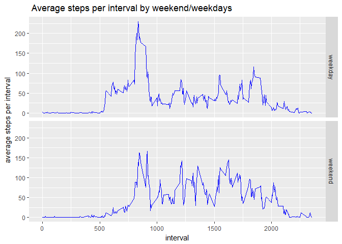

## Loading and preprocessing the data
First the setting of global options and loading needed library:

```r
knitr::opts_chunk$set(echo = T)
library(tidyverse)
```

```
## -- Attaching packages ----------------------------------------------------------------------------- tidyverse 1.2.1 --
```

```
## v ggplot2 2.2.1     v purrr   0.2.4
## v tibble  1.4.1     v dplyr   0.7.4
## v tidyr   0.7.2     v stringr 1.2.0
## v readr   1.1.1     v forcats 0.2.0
```

```
## -- Conflicts -------------------------------------------------------------------------------- tidyverse_conflicts() --
## x dplyr::filter() masks stats::filter()
## x dplyr::lag()    masks stats::lag()
```
Then the reading and processing steps:


```r
setwd(choose.dir(caption = "Select working folder")) # interactively set working directory

datafile <- "activity.csv"
data <- read.csv(datafile)
glimpse(data) # display unclean data
```

```
## Observations: 17,568
## Variables: 3
## $ steps    <int> NA, NA, NA, NA, NA, NA, NA, NA, NA, NA, NA, NA, NA, N...
## $ date     <fctr> 2012-10-01, 2012-10-01, 2012-10-01, 2012-10-01, 2012...
## $ interval <int> 0, 5, 10, 15, 20, 25, 30, 35, 40, 45, 50, 55, 100, 10...
```

```r
data.clean <- data %>% filter(!is.na(steps)) # remove nas
glimpse(data.clean) # display clean data
```

```
## Observations: 15,264
## Variables: 3
## $ steps    <int> 0, 0, 0, 0, 0, 0, 0, 0, 0, 0, 0, 0, 0, 0, 0, 0, 0, 0,...
## $ date     <fctr> 2012-10-02, 2012-10-02, 2012-10-02, 2012-10-02, 2012...
## $ interval <int> 0, 5, 10, 15, 20, 25, 30, 35, 40, 45, 50, 55, 100, 10...
```

```r
data.clean.daily.sum <- data.clean %>% 
    group_by(date) %>%  # group by date
    summarize(dailysteps = sum(steps)) # get sum of steps for each day
glimpse(data.clean.daily.sum) # display tibble of data
```

```
## Observations: 53
## Variables: 2
## $ date       <fctr> 2012-10-02, 2012-10-03, 2012-10-04, 2012-10-05, 20...
## $ dailysteps <int> 126, 11352, 12116, 13294, 15420, 11015, 12811, 9900...
```


## What is mean total number of steps taken per day?
The histogram of total daily steps is shown below:


```r
g <- ggplot(data = data.clean.daily.sum, aes(x = dailysteps)) +
    geom_histogram(fill = "blue", binwidth = 1000 ) +
    labs(title = "Histogram of total daily steps (Removed NA's)",
          x    = "Total steps per day",
          y    = "Frequency"
    )
 # display graph
```
Next, the mean is computed (using dplyr):


```r
mean.clean.daily <- data.clean.daily.sum %>%
    summarize(dailyaverage = mean(dailysteps)) %>% #compute mean
    .[[1,1]] # extract element as a number from a 1-element tibble
mean.clean.daily # display result
```

```
## [1] 10766.19
```
The median is computed similarly:

```r
median.clean.daily <- data.clean.daily.sum %>%
    summarize(dailymedian = median(dailysteps)) %>% 
    .[[1,1]] # extract element as a number from a 1-element tibble
median.clean.daily # display result
```

```
## [1] 10765
```
The mean and median steps taken daily are respectively, 1.0766189\times 10^{4} and 10765.

## What is the average daily activity pattern?
Next we make a time series plot (i.e. `type = "l"`) of the 5-minute interval (x-axis) and the average number of steps taken, averaged across all days (y-axis).
First we group the data by intervals

```r
mean.interval <- data.clean %>% 
    group_by(interval) %>%  # group now by intervals so can sum over all days
    summarize(intervalaverage = mean(steps)) # get sum
    mean.interval # display result tibble
```

```
## # A tibble: 288 x 2
##    interval intervalaverage
##       <int>           <dbl>
##  1        0          1.72  
##  2        5          0.340 
##  3       10          0.132 
##  4       15          0.151 
##  5       20          0.0755
##  6       25          2.09  
##  7       30          0.528 
##  8       35          0.868 
##  9       40          0     
## 10       45          1.47  
## # ... with 278 more rows
```
The graph of these means is plotted next:


```r
g <- ggplot(mean.interval, aes(x = interval, y = intervalaverage)) +
    geom_line(color = "purple", size = .60) + 
    labs(title = "Average steps per interval",
         x     = "Interval",
         y     = "Average steps per interval"
        )
g # display graph
```

<!-- -->
Determination of Which 5-minute interval, on average across all the days in the dataset, contains the maximum number of steps is shown in next:

```r
interval.with.max.mean <- mean.interval %>%  # recall that this is the tibble with mean per interval accross all days
    filter(intervalaverage == max(intervalaverage)) %>% # extract fields corresponding to maximum average
    select(interval) %>% # select interval
    .[[1,1]] # extract value in 1-element tibble
interval.with.max.mean # display result
```

```
## [1] 835
```
Hence the interval that contains the maximum is 835

## Imputing missing values
First, number of missing values is computed:

```r
num.na <- sum(is.na(data$steps))
num.na # display result
```

```
## [1] 2304
```
Hence there are 2304 missing values in the dataset
Second, the mean over each interval will be assigned to each missing value corresponding to the interval.

Third,the computation (using dplyr) of the imputation strategy is shown below:

```r
data.imputed <- data.clean %>% 
    group_by(interval) %>% 
    summarize(intervalmeans = mean(steps, na.rm = T)) %>% # at this point tibble consists of means for each interval
    inner_join(data, by = c("interval")) %>% #combine this to produce tibble with steps as well as corresponding interval mean
    transmute(steps = ifelse(is.na(steps),intervalmeans,steps),date, interval) # update replace NA's with mean
glimpse(data.imputed) # display tibble with imputed values
```

```
## Observations: 17,568
## Variables: 3
## $ steps    <dbl> 1.716981, 0.000000, 0.000000, 47.000000, 0.000000, 0....
## $ date     <fctr> 2012-10-01, 2012-10-02, 2012-10-03, 2012-10-04, 2012...
## $ interval <int> 0, 0, 0, 0, 0, 0, 0, 0, 0, 0, 0, 0, 0, 0, 0, 0, 0, 0,...
```
Fourth, a histogram of sum of steps taken per day with data with imputed values is created and shown below:

```r
# First get sum  of steps by date
data.imputed.daily.sum <- data.imputed %>% 
    group_by(date) %>% # group by date
    summarize(dailysteps = sum(steps, na.rm = T)) # get sum of steps for each date
glimpse(data.imputed.daily.sum) # display tibble of sum of steps 
```

```
## Observations: 61
## Variables: 2
## $ date       <fctr> 2012-10-01, 2012-10-02, 2012-10-03, 2012-10-04, 20...
## $ dailysteps <dbl> 10766.19, 126.00, 11352.00, 12116.00, 13294.00, 154...
```

```r
#then plot histogram using ggplot2
g <- ggplot(data = data.imputed.daily.sum, aes(x = dailysteps)) +
    geom_histogram(fill = "brown", binwidth = 1000) +
    labs(title = "Histogram of total daily steps (imputed NA's)",
         x    = "Total steps per day",
         y    = "Frequency"
         )
g # display graph (histogram)
```

<!-- -->

Next, the daily means and medians of the sum of steps are computed for imputed data


```r
mean.imputed.daily <- data.imputed.daily.sum %>%
    summarize(dailyaverage = mean(dailysteps)) %>% 
    .[[1,1]]
mean.imputed.daily # display result
```

```
## [1] 10766.19
```

```r
median.imputed.daily <- data.imputed.daily.sum %>%
    summarize(dailymedian = median(dailysteps)) %>% 
    .[[1,1]]
median.imputed.daily # display result
```

```
## [1] 10766.19
```

The mean and median are respectively 10766.19 and 10766.19.

## Are there differences in activity patterns between weekdays and weekends?
In this subsection, first, create an indicator for week-ends (again, using dplyr)

```r
data.imputed.new <- data.imputed %>% 
    mutate(dayindicator = 
               ifelse(weekdays(as.Date(date)) %in% c("Sunday","Saturday"), 
                      "weekend",
                      "weekday"
                      )
           ) %>% 
    mutate(dayindicator = as.factor(dayindicator))
glimpse(data.imputed.new) # display tibble of imputed data
```

```
## Observations: 17,568
## Variables: 4
## $ steps        <dbl> 1.716981, 0.000000, 0.000000, 47.000000, 0.000000...
## $ date         <fctr> 2012-10-01, 2012-10-02, 2012-10-03, 2012-10-04, ...
## $ interval     <int> 0, 0, 0, 0, 0, 0, 0, 0, 0, 0, 0, 0, 0, 0, 0, 0, 0...
## $ dayindicator <fctr> weekday, weekday, weekday, weekday, weekday, wee...
```
Next a panel plot containing a time series plot (i.e. `type = "l"`) of the 5-minute interval (x-axis) and the average number of steps taken, averaged across all weekday days or weekend days (y-axis) is created like so:
    

```r
data.imputed.daytype <- data.imputed.new %>% 
    group_by(interval, dayindicator) %>% 
    summarize(averagesteps = mean(steps))
g <- ggplot(data.imputed.daytype, aes(interval,averagesteps)) +
    geom_line(color = "blue", size = .60) +
    facet_grid(dayindicator~.) +
    labs(title = " Average steps per interval by weekend/weekdays",
         y      = "average steps per interval "
        )
g  # display graph
```

<!-- -->

From the plots above, it appears the activity during the weekday essentially peaks near the begining of the day and reduces for remainder whereas on the weekends, the activity is comparatively uniform during the day.

